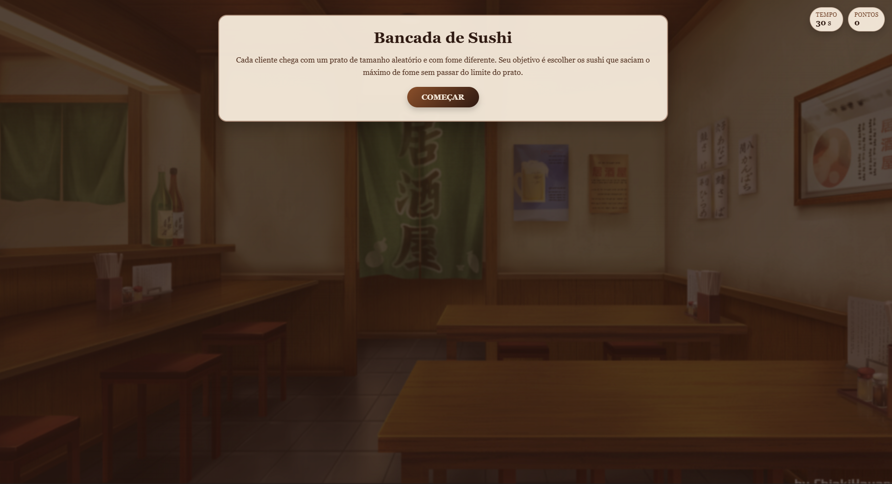
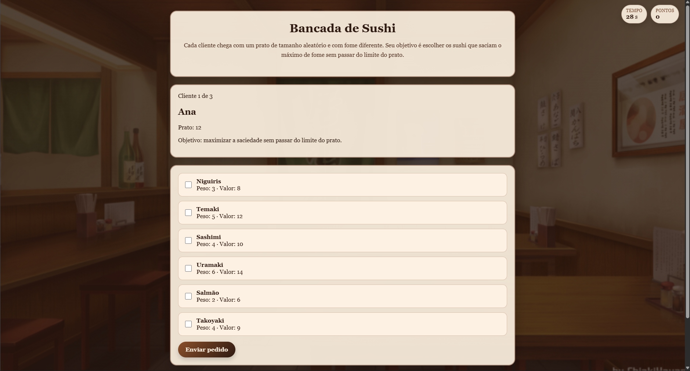
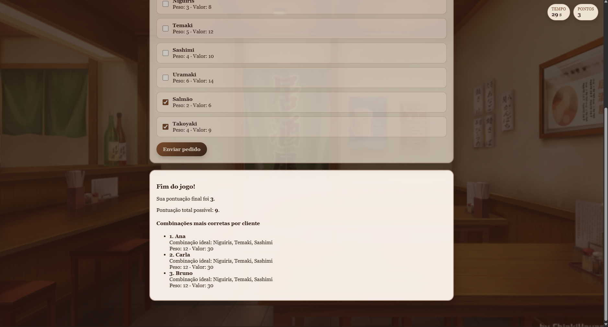

# Programação-Dinâmica_BancadaDeSushi

**Número da Lista**: 24<br>
**Conteúdo da Disciplina**: Knapsack<br>

## Alunos
|Matrícula | Aluno |
| -- | -- |
| 23/1039113  |  Leonardo Porporati Barcellos |
| 23/1039187  |  Yzabella Miranda Pimenta |

## Sobre
Este projeto implementa o algoritmo da Mochila 0/1 (0/1 Knapsack), da estratégia de Programação Dinâmica. O objetivo é ambientar o problema clássico da mochila em um jogo de uma bancada de sushi.

Cada cliente chega com um prato de tamanho aleatório (a capacidade da "mochila") e o jogador precisa escolher os sushi do cardápio para servir. Cada sushi possui um peso (espaço que ocupa no prato) e um valor (o quanto sacia a fome). O desafio é selecionar a combinação de sushi que maximiza a saciedade sem ultrapassar o limite do prato.

Ao final, o algoritmo de programação dinâmica calcula a combinação ótima para cada cliente e compara com as escolhas do jogador, mostrando a pontuação obtida e a pontuação máxima possível.

## Screenshots

<p align="center">
  
  <br>
  <sub>Tela inicial da Bancada de Sushi</sub>
</p>

---

<p align="center">
  
  <br>
  <sub>Tela do jogo com o prato do cliente e o cardápio de sushi</sub>
</p>

---

<p align="center">
  
  <br>
  <sub>Tela de resultados com a pontuação e as combinações ideais por cliente</sub>
</p>

## Instalação
**Linguagem**: TypeScript (back-end), JavaScript, HTML e CSS (front-end)<br>
**Framework**: Não foi utilizado (servidor HTTP nativo do Node.js)<br>
**Pré-requisitos**: [Node.js](https://nodejs.org/) (versão 18 ou superior) instalado.

### Como rodar

1. Clone o repositório:
```bash
git clone https://github.com/projeto-de-algoritmos-2026/G24_Programacao_Dinamica_PA-26.1.git
cd G24_Programacao_Dinamica_PA-26.1
```

2. Entre na pasta do back-end e instale as dependências:
```bash
cd back
npm install
```

3. Compile e inicie o servidor:
```bash
npm start
```

4. O servidor sobe e exibe no terminal o endereço de acesso. Abra no navegador:
```txt
http://localhost:3000
```

## Vídeo de Apresentação

<p align="center">
  Neste vídeo, apresentamos o trabalho desenvolvido:
</p>

<p align="center">
  <a href="https://youtu.be/Qx7o4ZJhiiM" target="_blank">
    
  </a>
</p>
